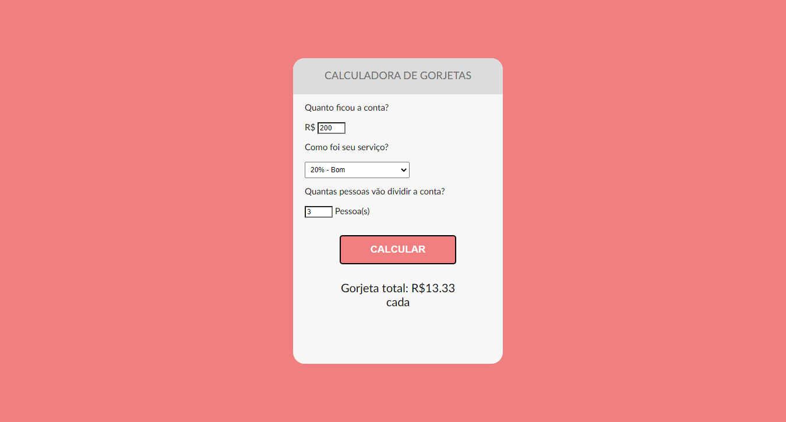

## Calculadora de Gorjetas

[🔗 Clique aqui para acessar](https://biogmmorais.github.io/Calculadora-de-Gorjeta/)

> Projeto Start OneBitCode

Nesse projeto utilizei HTML, CSS e Javascript para criar uma calculador de gorjetas. Onde podemos categorizar o serviço e de acordo com o que colocar atribuir uma porcentagem para a gorjeta, assim como atribuir um número de pessoas para que possamos dividir o valor da gorjeta.

## 🛠 Tecnologias

- HTML
- CSS
- Javascript

## 📨 Contato

guilhermemm97@gmail.com